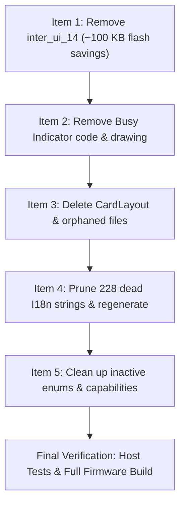

# Codebase Cleanup & Dead Code Removal Plan

This document details the identified dead code, orphaned components, and unreferenced resources across the Witchling Reader codebase, organized into prioritized cleanup items with exact files, architectural rationale, code changes, and verification plans.

---

## Overview & Expected Impact

| Item | Area | Category | Impact / Savings | Status |
|---|---|---|---|---|
| **Item 1** | UI Font Scale & `inter_ui_14` Font Data | Binary Flash Optimization | **~109 KB flash reclaimed** (removes 86 KB raw bitmap data + glyph/kerning tables) | **Completed & Verified** |
| **Item 2** | Busy Indicator Transition & Theme Drawing | Dead Code Removal | Eliminates ~70 lines in `ActivityManager` and `BaseTheme`, removes unused virtual hooks in `Activity` | **Completed & Verified** |
| **Item 3** | Orphaned Files & Unused UI Components | Source Tree Hygiene | Deletes `CardLayout` (258 lines), `FrontlightPanelActivity` (384 lines), and 3 unused icon headers | **Completed & Verified** |
| **Item 4** | 229 Dead I18n Translation Strings | Flash & Header Optimization | Pruned 229 dead keys in `english.yaml` and shrunk generated lookup tables in `lib/I18n/` | **Completed & Verified** |
| **Item 5** | Touch UI & Dead Capability Enums | Architecture Simplification | Cleans up obsolete `GestureActionsOverview`, `touchListActivation`, and inactive hardware predicates | **Completed & Verified** |

---

## Item 1: Prune Unreachable `inter_ui_14` Font Data (~100 KB Flash)

### Background & Rationale
In the previous change, the **UI Font Size** configuration was removed, locking the UI typography to Normal (`UI_FONT_SIZE_DEFAULT = 0`). However:
1. `src/main.cpp` (lines 155–158) still instantiates global objects `ui14RegularFont`, `ui14BoldFont`, and `ui14FontFamily` pointing to `inter_ui_14_regular` and `inter_ui_14_bold`.
2. Because these are global pointers in `main.cpp`, the linker includes both font bitmap tables in flash:
   - `inter_ui_14_regularBitmaps`: 41,295 bytes
   - `inter_ui_14_boldBitmaps`: 45,193 bytes
   - Glyph offsets and sparse kern tables: ~13,500 bytes
   - **Total wasted ROM/Flash: ~100 KB**.
3. In `applyUiFontScale()` (`src/main.cpp`), the condition `const bool large = SETTINGS.uiFontSize == CrossPointSettings::UI_FONT_SIZE_LARGE;` is always `false`. The branch `large ? ui14FontFamily : ...` is completely dead.
4. `src/UiFontScale.h` defines `UiFontLadder::STEPS[1]` (`{25, 30, 35}`), which is never used at runtime since step 0 always yields `{0, 0, 0}` growth.

### Proposed Changes

#### 1. `src/main.cpp`
- Remove:
  ```cpp
  // Only reachable through the LARGE step of the UI font ladder (see applyUiFontScale()).
  EpdFont ui14RegularFont(&inter_ui_14_regular);
  EpdFont ui14BoldFont(&inter_ui_14_bold);
  EpdFontFamily ui14FontFamily(&ui14RegularFont, &ui14BoldFont);
  ```
- Simplify `applyUiFontScale()` to bind only the default families:
  ```cpp
  void applyUiFontScale() {
    renderer.replaceFont(SMALL_FONT_ID, smallFontFamily);
    renderer.replaceFont(UI_10_FONT_ID, ui10FontFamily);
    renderer.replaceFont(UI_12_FONT_ID, ui12FontFamily);
  }
  ```
  *(Or inline this font binding into `setupDisplayAndFonts()` and remove `applyUiFontScale()` entirely).*

#### 2. `lib/EpdFont/builtinFonts/all.h`
- Remove `#include <builtinFonts/inter_ui_14_bold.h>` and `#include <builtinFonts/inter_ui_14_regular.h>`.
- Optionally remove or archive the generated header files `inter_ui_14_regular.h` and `inter_ui_14_bold.h`.

#### 3. `src/UiFontScale.h` & `src/CrossPointSettings.h`
- Simplify `UiFontLadder::STEPS` down to 1 step (`{23, 25, 30}`).
- In `CrossPointSettings.h`, `enum UI_FONT_SIZE` can be simplified or deprecated.
- In `src/components/UITheme.cpp`: `fontGrowth()` always returns `{0, 0, 0}`.

#### 4. `test/ui_font_ladder/UiFontLadderTest.cpp`
- Update test cases verifying multi-step ladders to verify the single fixed default typography.

### Verification Plan
- Build tests: `~/.platformio/penv/bin/uv run --with cmake --with ninja cmake --build build/test --target UiFontLadderTest && ./build/test/ui_font_ladder/UiFontLadderTest`
- Build firmware: `pio run -e default`
- Inspect `firmware.elf` with `nm -S --size-sort .pio/build/default/firmware.elf | grep inter_ui_14` to confirm 0 bytes of `inter_ui_14` remain in the binary.
- Check flash size reduction (expected: ~100 KB smaller).

---

## Item 2: Remove Dead "Busy Indicator" Logic & Theme Drawing

### Background & Rationale
`showBusyIndicator` is now defaulted to `0` and forced to `0` on boot. As a result:
- `ActivityManager::showBusyIndicator()` exits on line 1: `if (!SETTINGS.showBusyIndicator) return;`.
- All subsequent logic (transition timing checks, fast refresh thresholds, render locking, and frame syncing) is unreachable.
- `BaseTheme::drawBusyIndicator()` in `src/components/themes/BaseTheme.cpp` is never executed.
- `Activity::suppressesBusyIndicator()` is never evaluated.

### Proposed Changes

#### 1. `src/activities/ActivityManager.h` & `src/activities/ActivityManager.cpp`
- Remove `ActivityManager::showBusyIndicator()` method definition and implementation (~65 lines).
- Remove calls to `showBusyIndicator()` in `ActivityManager::startPendingActivity()` and `ActivityManager::dispatchAction()`.
- Remove `framebufferPreparedThisTick` variable if it is only used by `showBusyIndicator()`.

#### 2. `src/components/themes/BaseTheme.h` & `src/components/themes/BaseTheme.cpp`
- Remove `virtual Rect drawBusyIndicator(...)` declaration and the ~50-line implementation that renders the hourglass icon and handles `PopupShip::Async`.

#### 3. `src/activities/Activity.h` and Subclasses
- Remove `virtual bool suppressesBusyIndicator() const { return false; }` from `Activity.h`.
- Remove overrides in:
  - `src/activities/boot_sleep/BootActivity.h`
  - `src/activities/boot_sleep/SleepActivity.h`
  - `src/activities/util/FrontlightPanelActivity.h`

#### 4. `src/CrossPointSettings.h` & `src/CrossPointSettings.cpp`
- Remove `uint8_t showBusyIndicator` field and its normalization line `settings.showBusyIndicator = 0;`.

### Verification Plan
- Build firmware: `pio run -e default`
- Verify activity transitions (navigating menus, opening reader, going to sleep) remain fast and crisp without regressions.

---

## Item 3: Delete Orphaned Files & Unused UI Components

### Background & Rationale
Several files and icons left behind from upstream features or stripped subsystems are no longer referenced by any compilation unit:

1. **`src/components/CardLayout.h` & `src/components/CardLayout.cpp`** (258 lines):
   - Created for the Reading Statistics UI card layout (`card()`, `statGrid()`, `rowLR()`, `centeredMessage()`).
   - Completely unreferenced in the entire repository.
2. **`src/activities/util/FrontlightPanelActivity.h` & `src/activities/util/FrontlightPanelActivity.cpp`** (384 lines):
   - A touch-based frontlight drawer.
   - Guarded entirely under `#if CP_TOUCH_UI`. Since `platformio.ini` enforces `-DCP_TOUCH_UI=0` (X4 has no touch), it compiles to an empty object file and is never constructed.
3. **Unused Icons in `src/components/icons/`**:
   - `cog.h`: Zero includes across the codebase.
   - `settings.h`: Zero includes (LyraTheme includes `settings2.h`).
   - `sunIcons.h`: Only included by `FrontlightPanelActivity.cpp`.

### Proposed Changes
- Delete `src/components/CardLayout.h` and `src/components/CardLayout.cpp`.
- Delete `src/activities/util/FrontlightPanelActivity.h` and `src/activities/util/FrontlightPanelActivity.cpp`.
- Delete `src/components/icons/cog.h`, `src/components/icons/settings.h`, and `src/components/icons/sunIcons.h`.

### Verification Plan
- Build firmware: `pio run -e default` (confirm zero missing header or unresolved symbol errors).
- Run unit test suites: `UiFontLadderTest` and `SettingsGroupingTest`.

---

## Item 4: Prune 228 Dead I18n Translation Strings

### Background & Rationale
In `lib/I18n/translations/english.yaml`, **228 string keys** are unreferenced across `src/`, `lib/`, and `test/`. These are leftovers from removed features:
- **Status bar recent change**: `STR_CHAPTER: "Chapter"` (chapter progress bar option removed in commit `8597da83`).
- **USB drive / serial**: `STR_USB_DRIVE`, `STR_USB_TRANSFER`, `STR_SWITCH_TO_USB_DRIVE`, `STR_USB_DRIVE_DESC`, etc.
- **Clock / Weather / NTP**: `STR_CLOCK`, `STR_TIMEZONE`, `STR_NTP_SERVER`, `STR_24H`, `STR_12H`, `STR_TZ_*`, `STR_DST_*`, `STR_CLOCK_DRIFT`, etc.
- **Reading Statistics**: `STR_READING_STATS`, `STR_READING_STATS_TOTAL_TIME`, `STR_READING_STATS_SESSIONS`, `STR_READING_STATS_PAGES`, `STR_READING_STATS_BOOKS`, `STR_READING_STATS_STREAK`, etc.
- **TXT / Markdown Reader**: `STR_TXT_FONT_FAMILY`, `STR_TXT_FONT_SIZE`, etc.
- **Touch / Gestures**: `STR_TOUCH_READER_*`, `STR_GEST_*`, `STR_TOUCH_UI_*`
- **Frontlight**: `STR_READING_LIGHT`, `STR_RESTORE_LIGHT_ON_WAKE`, `STR_BTN_ACT_LIGHT_*`
- **Themes**: `STR_THEME_CLASSIC`, `STR_THEME_LYRA_EXTENDED`, `STR_THEME_LYRA_CAROUSEL`

Every key in `english.yaml` generates an entry in `I18nKeys.h` (an enum value) and an array entry in `I18nStrings.cpp` (baked string literal flash table).

### Proposed Changes
1. Remove all 228 unreferenced keys from `lib/I18n/translations/english.yaml`.
2. Run generator script:
   ```bash
   python3 scripts/gen_i18n.py
   ```
3. Verify that `I18nKeys.h` and `I18nStrings.cpp` are regenerated with only active strings (~528 strings down from 756 strings).

### Verification Plan
- Run generator: `python3 scripts/gen_i18n.py`
- Run unit test suites: `~/.platformio/penv/bin/uv run --with cmake --with ninja cmake --build build/test --target SettingsGroupingTest && ./build/test/settings_grouping/SettingsGroupingTest`
- Build firmware: `pio run -e default`

---

## Item 5: Clean Up Inactive Enums & Hardware Predicates

### Background & Rationale
Because this fork is tailored exclusively for the **Xteink X4** (no touch, physical buttons, no IMU, no frontlight):
1. **`src/activities/settings/SettingInfo.h`**:
   - `SettingAction::GestureActionsOverview` is never mapped in `SettingActionDispatch.cpp` or used anywhere.
2. **`src/CrossPointSettings.h`**:
   - `enum TOUCH_LIST_ACTIVATION` and `uint8_t touchListActivation` are obsolete remnants of touch-list navigation.
   - `BTN_UNUSED_BIONIC_READING` is an obsolete enum value.
3. **`src/SettingsList.h`**:
   - `SettingRequires` predicates (`TouchPanel`, `TiltSensor`, `SelectableGrayscaleLut`, `ReadingLight`, `WarmLight`, `MultiTouchPanel`) are all hardcoded to `return false;`. None of them are assigned to any setting row in `SettingsList.h` except `SunlightFadingPanel`.

### Proposed Changes
- Remove `SettingAction::GestureActionsOverview`.
- Remove `touchListActivation` and `enum TOUCH_LIST_ACTIVATION`.
- Prune unneeded `SettingRequires` cases that have no setting attached.

### Verification Plan
- Build firmware: `pio run -e default`
- Run settings grouping tests: `SettingsGroupingTest`

---

## Recommended Execution Order



1. **Step 1 (Immediate Flash Win)**: Item 1 (`inter_ui_14` font removal) yields the largest immediate binary size reduction (~100 KB).
2. **Step 2 (Source Cleanliness)**: Items 2 & 3 remove dead C++ routines and delete orphaned files (`CardLayout`, `FrontlightPanelActivity`, icons).
3. **Step 3 (String Table Shrink)**: Item 4 cleans up translation tables.
4. **Step 4 (Final Polish)**: Item 5 removes unused enums.
