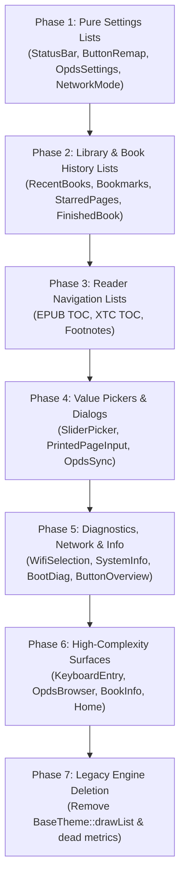

# Witchling Reader — FreeInk SDK UI Migration Plan

This document establishes a complete, phased architecture and execution plan for migrating the remaining Witchling Reader user interfaces from the legacy drawing engine (`BaseTheme::drawList`, manual coordinate calculations, and custom scroll loops) to the **FreeInk SDK UI** framework (`FreeInkUI`).

> [!NOTE]
> **Status:** Phase 1 (Pure Settings & Configuration Lists) and Phase 2 (Library & Book History Lists) have been successfully implemented and verified. Phases 3–7 remain scheduled according to the roadmap below.

---

## 1. Executive Summary & Goals

### Current Architecture: Dual-Engine State
The codebase currently operates two distinct UI rendering pipelines:
1. **Modern FreeInk SDK UI (`FreeInkUI`)**: Built on top of `UiAppHost` (`freeink::ui::FreeInkApp<24, 6>`), `UiListActivity`, `MenuListActivity`, `TabbedUiListActivity`, and `ConfirmDialog`. Features declarative screen builders, automatic hit-testing, atomic button navigation sync, virtualized windowing, and built-in widget styles.
2. **Legacy Theme & Ad-Hoc Renderer**: Built on direct `GfxRenderer` drawing, `GUI.drawList(...)` (in `BaseTheme` and `LyraTheme`), manual line-height math, and custom `ButtonNavigator` loops.

### Key Objectives
* **Unify UI Architecture**: Eliminate the maintenance burden of two parallel UI systems.
* **Deprecate Legacy List Code**: Remove `BaseTheme::drawList()`, `LyraTheme::drawList()`, and related dead metrics once all call sites are migrated (~450 lines of complex rendering code).
* **Consistent User Experience**: Unify selection styling, focus highlights, row padding, toggle switches, and tab bars across all screens.
* **Touch & Button Parity**: FreeInkUI natively supports both touch interaction (`CP_TOUCH_UI`) and button navigation (`ButtonNavigator` + `freeink::ui::ListNav`), allowing boards with or without touchscreens to run the identical activity codebase.
* **Strict ESP32-C3 Flash Discipline**: Strictly adhere to the single `FreeInkApp<24, 6>` instantiation discipline to prevent template bloat on 4MB/8MB ESP32-C3 partitions.

---

## 2. Codebase Inventory: Current UI State

Total activity classes in repository: **53** (48 concrete activities/dialogs, 5 base/utility classes).

### Already Migrated to FreeInk SDK UI (14 screens)
| Screen / Activity | Base Class / Component | Description |
|---|---|---|
| `FileBrowserActivity` | `UiListActivity` | File system navigation with virtualized `fui::List` |
| `FileContextMenuActivity` | `MenuListActivity` | File operations (Open, Star, Info, Delete) |
| `SettingsActivity` | `TabbedUiListActivity` | Main 4-tab system settings (Display, Reader, Controls, System) |
| `SettingsSubmenuActivity` | `MenuListActivity` | Generic submenus for hierarchical settings |
| `HomeMoreActivity` | `MenuListActivity` | Overflow menu for items moved off the home screen |
| `FontSelectionActivity` | `UiListActivity` | Font picker with live preview blit |
| `EnumSelectionActivity` | `UiListActivity` | Dynamic multi-choice enum setting picker |
| `DictionarySelectionActivity` | `UiListActivity` | StarDict dictionary selector |
| `EpubReaderMenuActivity` | `TabbedUiListActivity` | In-reader 4-tab menu (Navigation, Settings, Sync, Tools) |
| `QuickOverridesActivity` | `MenuListActivity` | Reader quick font/layout toggles |
| `ConfirmationActivity` | `UiAppHost` / `ConfirmDialog` | Modal confirmation prompt |
| `ClearCacheActivity` | `UiAppHost` / `ConfirmDialog` | Cache wipe confirmation |
| `ScreenRepairActivity` | `UiAppHost` / `ConfirmDialog` | Display inversion/refresh cycle prompt |
| `OtaUpdateActivity` | `UiAppHost` / `ConfirmDialog` | OTA firmware download and update prompt |

---

### Screens Requiring Migration (35 screens)

```
┌───────────────────────────────────────────────────────────────────────────────────┐
│                           35 UNMIGRATED SCREENS                                   │
├───────────────────────┬───────────────────────┬───────────────────────────────────┤
│ Tier 1: Pure Lists    │ Tier 2: Settings/Diag │ Tier 3: Reader Overlays & Pickers │
│ (9 legacy drawList)   │ (5 tables/dashboards) │ (6 menus, TOC, footnotes)         │
├───────────────────────┼───────────────────────┼───────────────────────────────────┤
│ • RecentBooks (list)  │ • StatusBarSettings   │ • EpubReaderChapterSelection      │
│ • GlobalBookmarks     │ • ButtonRemap         │ • XtcReaderChapterSelection       │
│ • StarredPages        │ • ButtonOverview      │ • EpubReaderFootnotes             │
│ • FinishedBook        │ • SystemInformation   │ • SliderPickerActivity            │
│ • WifiSelection       │ • BootDiagnostics     │ • EpubReaderPercentSelection      │
│ • NetworkModeSelect   │                       │ • EpubReaderPrintedPageInput      │
│ • OpdsServerList      │                       │                                   │
│ • OpdsSettings        │                       │                                   │
└───────────────────────┴───────────────────────┴───────────────────────────────────┘
│ Tier 4: Complex Screens & Utilities (15 remaining)                                │
│ • HomeActivity (dashboard/carousel)           • KeyboardEntryActivity (virtual KB)│
│ • BookInfoActivity (metadata view)            • FullScreenMessageActivity (alerts)│
│ • OpdsBookBrowserActivity (catalog client)    • SdFirmwareUpdateActivity (flasher)│
│ • CrossPointWebServerActivity (transfer)      • BmpViewerActivity (image viewer)  │
│ • OpdsProgressionSyncActivity (sync dialog)   • DictionaryDefinitionActivity      │
│ • DictionaryWordSelectActivity (highlight)    • EpubRenderBenchmarkActivity       │
│ • EpubReaderActivity / XtcReaderActivity (core reader viewport)                   │
│ • BootActivity / SleepActivity (system state displays)                            │
└───────────────────────────────────────────────────────────────────────────────────┘
```

---

## 3. Architecture & Technical Patterns

Every migrated screen must follow established patterns to prevent performance and flash regressions.

### Pattern A: Standard Virtualized List (`UiListActivity`)
Used for dynamic or large lists (file items, books, chapters, networks).
```cpp
class MyListActivity final : public UiListActivity {
 public:
  MyListActivity(GfxRenderer& r, MappedInputManager& m)
      : UiListActivity("MyList", r, m) {}

 protected:
  int listCount() const override { return items.size(); }
  const char* headerTitle() const override { return tr(STR_MY_TITLE); }
  
  void buildScreen(UiScreen& screen) override {
    // 1. Establish layout margins & header spacer
    screen.setContentMarginFromScreen(themeMargins());
    
    // 2. Configure list properties
    fui::ListProps props;
    props.count = static_cast<uint16_t>(listCount());
    props.action = ACTION_ROW;
    props.inputMask = fui::InputTouch;
    props.labelText = screen.theme().bodyText;
    
    // 3. Sync scroll viewport & materialize visible window (sliding window)
    syncListViewport(screen, props);
    materializeListWindow();
    
    props.items = windowItems.data();
    props.itemsWindowFirst = windowFirst;
    props.itemsWindowCount = windowCount;
    screen.list(props);
  }

  void activateIndex(int index) override {
    // Handle row selection
  }
};
```

### Pattern B: Settings / Action Menu (`MenuListActivity`)
Used for settings lists with `SettingInfo` items, toggles, steppers, and submenus.
```cpp
class MyMenuActivity final : public MenuListActivity {
 public:
  MyMenuActivity(GfxRenderer& r, MappedInputManager& m)
      : MenuListActivity("MyMenu", r, m) {
    menuItems.push_back(SettingInfo::Toggle(STR_OPTION_A, &SETTINGS.optionA));
    menuItems.push_back(SettingInfo::Submenu(STR_SUBMENU, &submenuItems));
    initMenuList();
  }
};
```

### Pattern C: Modal Dialogs (`ConfirmDialog` / `UiAppHost`)
Used for transient popups, repair actions, warnings, and confirmations.
```cpp
class MyPromptActivity final : public Activity, private UiAppHost {
  // Uses ConfirmDialog helper to render header, body text, and Cancel/Confirm buttons
};
```

### Pattern D: Live Preview Injection (`afterUiRender`)
When a list activity also renders a custom preview area (like `FontSelectionActivity` or `StatusBarSettingsActivity`), reserve space during `buildScreen` using `screen.spacer(previewHeight)` and draw the live preview in `afterUiRender()`.

---

## 4. Phased Migration Roadmap



---

### Phase 1: Pure Settings & Configuration Lists — ✅ COMPLETED
**Target**: Screens with static or small configuration row sets that previously used `GUI.drawList(...)`.

| Activity | Previous State | Target Base Class | Status & Implementation Notes |
|---|---|---|---|
| [`NetworkModeSelectionActivity`](file:///home/syafiq/code/witchling-reader/src/activities/network/NetworkModeSelectionActivity.h) | `GUI.drawList` (3 options) | `UiListActivity` | ✅ Migrated. 3-row list with title and 2-line subtitle. Preserved `NetworkModeResult` contract. |
| [`StatusBarSettingsActivity`](file:///home/syafiq/code/witchling-reader/src/activities/settings/StatusBarSettingsActivity.h) | `GUI.drawList` + live sample bar preview | `UiListActivity` | ✅ Migrated. Dynamic item visibility, live preview bar rendered in `afterUiRender()`. |
| [`ButtonRemapActivity`](file:///home/syafiq/code/witchling-reader/src/activities/settings/ButtonRemapActivity.h) | `GUI.drawList` with action strings | `UiListActivity` | ✅ Migrated. 4-step wizard using `handleCustomInput()`, front-button sampling, and side-key resets. |
| [`OpdsSettingsActivity`](file:///home/syafiq/code/witchling-reader/src/activities/settings/OpdsSettingsActivity.h) | `GUI.drawList` (server name, URL, user, pass) | `UiListActivity` | ✅ Migrated. Field editing via `KeyboardEntryActivity`, password masking, server deletion flow. |
| [`OpdsServerListActivity`](file:///home/syafiq/code/witchling-reader/src/activities/settings/OpdsServerListActivity.h) | `GUI.drawList` of configured servers | `UiListActivity` | ✅ Migrated. Virtualized windowing (`LIST_WINDOW_CAPACITY = 24`), picker and settings modes, empty list handling. |

**Phase 1 Verification**:
- PlatformIO C3 Build: **Passed** (`pio run -e default`).
- RAM: 18.0% (58,896 bytes — 0 byte delta vs baseline).
- Flash: 82.3% (5,394,001 bytes — net delta of +5.4 KB for all 5 screens combined). Zero template expansion.

---

### Phase 2: Library & Book History Lists — ✅ COMPLETED
**Target**: User content lists previously calling `GUI.drawList(...)`.

| Activity | Previous State | Target Base Class | Status & Implementation Notes |
|---|---|---|---|
| [`RecentBooksActivity`](file:///home/syafiq/code/witchling-reader/src/activities/home/RecentBooksActivity.h) | Dual-mode: Grid view + List view via `GUI.drawList` | `UiListActivity` | ✅ Migrated. List view mode migrated to FreeInkUI list with book title, author/series, and reading progress percent. Grid view and background cover extraction pipeline preserved 100%. |
| [`GlobalBookmarksActivity`](file:///home/syafiq/code/witchling-reader/src/activities/home/GlobalBookmarksActivity.h) | `GUI.drawList` with multi-line chapter/title | `UiListActivity` | ✅ Migrated. Book headers set as non-selectable section headers (`isHeader`), bookmark entries selectable. Left (Rename) and Right (Delete) actions preserved via `handleCustomInput()`. |
| [`StarredPagesActivity`](file:///home/syafiq/code/witchling-reader/src/activities/reader/StarredPagesActivity.h) | `GUI.drawList` in reader overlay | `UiListActivity` | ✅ Migrated. In-book bookmark list using windowed `fui::ListProps`. Confirm jumps to page; Left renames; Right deletes; Back cancels cleanly. |
| [`FinishedBookActivity`](file:///home/syafiq/code/witchling-reader/src/activities/reader/FinishedBookActivity.h) | `GUI.drawList` for completion actions | `UiListActivity` | ✅ Migrated. Congratulations message and next book cover thumbnail + metadata composited via `afterUiRender()`, action items rendered via FreeInkUI list. |

**Phase 2 Verification**:
- PlatformIO C3 Build: **Passed** (`pio run -e default`).
- RAM: 18.0% (58,896 bytes — 0 byte delta vs baseline).
- Flash: 82.4% (5,399,531 bytes — net delta of +5.5 KB for all 4 Phase 2 screens combined). Zero template expansion.

---

### Phase 3: Reader In-Book Navigation Lists
**Target**: Reader navigation screens that currently hand-roll list scrolling and manual coordinate positioning with `renderer.drawText()`.

| Activity | Current State | Target Base Class | Specific Tasks |
|---|---|---|---|
| [`EpubReaderChapterSelectionActivity`](file:///home/syafiq/code/witchling-reader/src/activities/reader/EpubReaderChapterSelectionActivity.h) | Hand-crafted TOC scrolling loop (`startY = 60`, `lineHeight = 30`) | `UiListActivity` | • Replace custom page items calculation with `syncListViewport()`.<br/>• Indent nested TOC levels via `props.labelText` margin or indentation prefix.<br/>• Instant scroll jumping on large books with hundreds of chapters. |
| [`XtcReaderChapterSelectionActivity`](file:///home/syafiq/code/witchling-reader/src/activities/reader/XtcReaderChapterSelectionActivity.h) | Hand-crafted manga TOC scroll loop | `UiListActivity` | • Bind chapter titles and page ranges to `windowItems`.<br/>• Smooth page jump on selection. |
| [`EpubReaderFootnotesActivity`](file:///home/syafiq/code/witchling-reader/src/activities/reader/EpubReaderFootnotesActivity.h) | Hand-crafted footnote list with custom separator line | `UiListActivity` | • Convert footnotes and jump links into `windowItems`.<br/>• Use FreeInk list item headers (`isHeader`) to partition footnotes from external links. |

---

### Phase 4: Standalone Value Pickers & Dialogs
**Target**: Numeric steppers, slider screens, and transient dialogs.

| Activity | Current State | Target Base Class / FreeInk Component | Specific Tasks |
|---|---|---|---|
| [`SliderPickerActivity`](file:///home/syafiq/code/witchling-reader/src/activities/SliderPickerActivity.h) | Hand-drawn slider track, knob, and percent text | `UiAppHost` / `freeink::ui::Slider` | • Replace manual `renderer.fillRect` track and knob drawing with FreeInk's `freeink::ui::SliderProps`.<br/>• Retain coarse/fine button step acceleration (`buttonNavigator.onPressAndContinuous`). |
| [`EpubReaderPercentSelectionActivity`](file:///home/syafiq/code/witchling-reader/src/activities/reader/EpubReaderPercentSelectionActivity.h) | Subclass of `SliderPickerActivity` | Inherits migrated `SliderPickerActivity` | • Inherits the FreeInk slider implementation automatically. |
| [`EpubReaderPrintedPageInputActivity`](file:///home/syafiq/code/witchling-reader/src/activities/reader/EpubReaderPrintedPageInputActivity.h) | Hand-rolled digit carousel layout | `UiAppHost` / Custom FreeInk widget | • Render digit slots and active cursor via declarative UI container.<br/>• Clean button navigation for incrementing digits. |
| [`OpdsProgressionSyncActivity`](file:///home/syafiq/code/witchling-reader/src/activities/reader/OpdsProgressionSyncActivity.h) | Manual centering and `GUI.drawHeader` | `UiAppHost` / `freeink::ui::OptionDialog` | • Standardize sync status, conflict resolution, and retry prompt. |

---

### Phase 5: Network, Diagnostics & Information Views
**Target**: Network scanning, technical system specifications, and button mapping dashboards.

| Activity | Current State | Target Base Class / FreeInk Component | Specific Tasks |
|---|---|---|---|
| [`WifiSelectionActivity`](file:///home/syafiq/code/witchling-reader/src/activities/network/WifiSelectionActivity.h) | `GUI.drawList` + custom signal drawing loop | `UiListActivity` | • Render AP names and security badges in `windowItems`.<br/>• Draw signal bars via custom icon rendering in item values or `afterUiRender()`. |
| [`SystemInformationActivity`](file:///home/syafiq/code/witchling-reader/src/activities/settings/SystemInformationActivity.h) | Hand-drawn 2-column layout | `UiAppHost` / `freeink::ui::Table` | • Structured key-value table for flash, RAM, firmware version, and battery. |
| [`BootDiagnosticsActivity`](file:///home/syafiq/code/witchling-reader/src/activities/settings/BootDiagnosticsActivity.h) | Hand-drawn 2-column diagnostic log | `UiAppHost` / `freeink::ui::Table` | • Standardize reset reason, probe status, and hardware pins display. |
| [`ButtonActionsOverviewActivity`](file:///home/syafiq/code/witchling-reader/src/activities/settings/ButtonActionsOverviewActivity.h) | Hand-calculated 4-column layout | `UiAppHost` / `freeink::ui::Table` | • Tabular layout: Button name, Short Press, Double Press, Long Press. |
| [`SdFirmwareUpdateActivity`](file:///home/syafiq/code/witchling-reader/src/activities/settings/SdFirmwareUpdateActivity.h) | Manual text & `GUI.drawProgressBar` | `UiAppHost` / `fui::ProgressBar` | • Modernize progress display during SPI flashing. |
| [`CrossPointWebServerActivity`](file:///home/syafiq/code/witchling-reader/src/activities/network/CrossPointWebServerActivity.h) | Manual coordinate centering | `UiAppHost` | • Clean layout for IP address, QR code, and transfer counts. |

---

### Phase 6: High-Complexity Surfaces & Core Utilities
**Target**: Interactive subsystems, large dashboards, and catalog clients.

| Activity | Current State | Target Base Class / FreeInk Component | Specific Tasks |
|---|---|---|---|
| [`BookInfoActivity`](file:///home/syafiq/code/witchling-reader/src/activities/home/BookInfoActivity.h) | Manual text wrapping and `GUI.drawHeader` | `UiAppHost` / `fui::TextArea` | • Book title, author, cover thumbnail, and scrollable synopsis. |
| [`KeyboardEntryActivity`](file:///home/syafiq/code/witchling-reader/src/activities/util/KeyboardEntryActivity.h) | Hand-crafted 2D grid matrix navigation | `UiAppHost` / `freeink::ui::QwertyKeyboard` | • Evaluate FreeInk SDK's `components/keyboard/keyboard.h` for touch and D-pad button navigation. |
| [`OpdsBookBrowserActivity`](file:///home/syafiq/code/witchling-reader/src/activities/browser/OpdsBookBrowserActivity.h) | Custom paginated catalog list | `UiListActivity` / `fui::BookCard` | • Catalog feed entries rendered with standardized book items and format badges. |
| [`HomeActivity`](file:///home/syafiq/code/witchling-reader/src/activities/home/HomeActivity.h) | Legacy `BaseTheme` cover & menu drawing | FreeInk UI Integration | • Utilize `freeink::ui::CoverCarousel` / `CoverGrid` for recent reading hero slot.<br/>• Render home navigation entries via `freeink::ui::TileGrid` or `fui::List`. |

#### Excluded Surfaces (Intentionally Direct Renderers)
* **Core Reader Viewports** ([`EpubReaderActivity`](file:///home/syafiq/code/witchling-reader/src/activities/reader/EpubReaderActivity.h), [`XtcReaderActivity`](file:///home/syafiq/code/witchling-reader/src/activities/reader/XtcReaderActivity.h)): Must remain dedicated high-performance text/image blitting engines that draw directly to `GfxRenderer` framebuffers for battery life and speed.
* **Low-Level System States** ([`BootActivity`](file:///home/syafiq/code/witchling-reader/src/activities/boot_sleep/BootActivity.h), [`SleepActivity`](file:///home/syafiq/code/witchling-reader/src/activities/boot_sleep/SleepActivity.h), [`BmpViewerActivity`](file:///home/syafiq/code/witchling-reader/src/activities/util/BmpViewerActivity.h), [`FullScreenMessageActivity`](file:///home/syafiq/code/witchling-reader/src/activities/util/FullScreenMessageActivity.h)): Kept minimal without allocating FreeInkApp state to ensure bulletproof boot and sleep sequencing.

---

### Phase 7: Deprecation & Dead Code Pruning
Once Phases 1–5 are complete and no callers of the legacy list drawer remain:
1. **Delete Legacy List Drawing Routines**:
   * Remove `virtual void drawList(...)` from [`BaseTheme.h`](file:///home/syafiq/code/witchling-reader/src/components/themes/BaseTheme.h) and [`BaseTheme.cpp`](file:///home/syafiq/code/witchling-reader/src/components/themes/BaseTheme.cpp) (~170 lines).
   * Remove override `void drawList(...)` from [`LyraTheme.h`](file:///home/syafiq/code/witchling-reader/src/components/themes/lyra/LyraTheme.h) and [`LyraTheme.cpp`](file:///home/syafiq/code/witchling-reader/src/components/themes/lyra/LyraTheme.cpp) (~250 lines).
2. **Prune Obsolete Theme Metrics**:
   * Prune unused fields in `ThemeMetrics` (`listRowHeight`, `listWithSubtitleRowHeight`, `listSidePadding`, etc.) that were only used by legacy `drawList`.
3. **Flash & Binary Audit**:
   * Reclaim an estimated **~15–20 KB of flash** from deleted layout math and dead string formatting routines.

---

## 5. Verification & Safety Protocol

For each migrated screen:
1. **Compilation Check**:
   ```bash
   pio run -e default
   ```
2. **Host Unit Tests**:
   ```bash
   ~/.platformio/penv/bin/uv run --with cmake --with ninja cmake --build build/test --target SettingsGroupingTest
   ./build/test/settings_grouping/SettingsGroupingTest
   ```
3. **Binary Size & Flash Overhead Audit**:
   Ensure `firmware.elf` does not exceed the partition limit (~198 KB free headroom on C3). Check size deltas using:
   ```bash
   pio run -e default -t size
   ```
4. **Hardware Validation Criteria**:
   * Up/Down/Left/Right hardware buttons navigate items with consistent wrapping.
   * Confirm button activates row without double-firing.
   * Back button returns cleanly to the parent activity without stack leaks.
   * E-ink partial refreshes update cleanly without ghosting or clipping.
